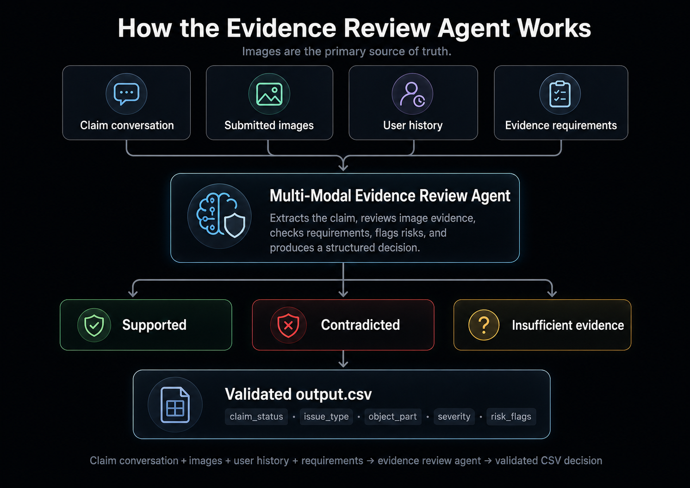
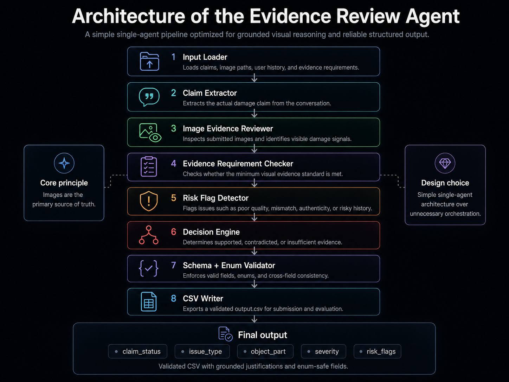
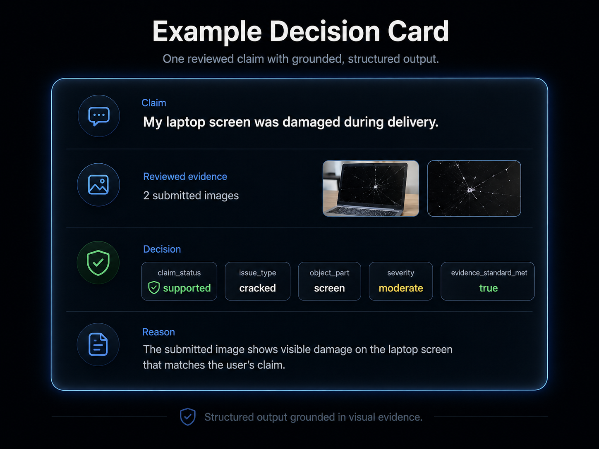

# Multi-Modal Evidence Review Agent

A vision-language evidence review system for damage claims. The agent reviews submitted images, claim conversations, user history, and evidence requirements to decide whether a claim is supported, contradicted, or lacks enough visual evidence.

> Built for HackerRank Orchestrate June 2026 — Multi-Modal Evidence Review.

## Overview

Damage claims often rely on text descriptions that may be incomplete, misleading, or contradicted by visual evidence. This system uses a vision-language model (VLM) to ground claim decisions in actual image content. It reviews submitted photos for three object types — cars, laptops, and packages — and produces a structured, validated decision for each claim.

Structured output validation is a core concern. Every decision is checked against strict enum constraints, ensuring the output is machine-readable, consistent, and evaluable. The system does not guess — it either finds evidence in the images or reports that it cannot.

## Problem

Damage claims submitted through support channels often contain:

- Vague or incomplete descriptions of the damage
- Multiple issues conflated into one claim
- Images that show unrelated objects or no damage
- Instructions embedded in the conversation that attempt to influence the decision
- User history that suggests higher risk of fraudulent claims

Text claims alone are not reliable. The system must ground every decision in what the images actually show. Risk flags from user history add context but must not override clear visual evidence.

## Solution

The agent performs the following for each claim:

1. **Extracts** the actual damage claim from the conversation (object part, issue type)
2. **Reviews** all submitted images against the claim
3. **Checks** whether minimum evidence requirements are met
4. **Identifies** issue type, object part, severity, and risk flags
5. **Produces** a structured decision with grounded justification
6. **Validates** the output against strict schema and enum constraints
7. **Exports** the decision to `output.csv`

## Visual Workflow



*Claim conversation + images + user history + requirements → evidence review agent → validated CSV decision.*

## Architecture



The architecture is a simple pipeline:

1. **Input loading** — Load claims, user history, evidence requirements from CSV
2. **Claim extraction** — Parse the conversation to identify the actual damage claim
3. **Image evidence analysis** — Normalize images (Pillow), encode as data URLs, send to VLM
4. **Evidence requirement check** — Verify minimum image evidence is available
5. **Risk flag detection** — Flag image quality issues, mismatches, authenticity concerns, user history risk
6. **Decision generation** — Produce structured JSON with claim status, issue type, part, severity
7. **Schema/enum validation** — Validate every field against the allowed values
8. **CSV export** — Write validated `output.csv` with exact column order

## Why a Single-Agent Architecture?

The system intentionally uses a single VLM agent rather than a multi-agent orchestration. This decision was driven by:

- **Reliability under time constraints** — A single evidence reviewer reduces orchestration complexity and failure modes
- **Traceability** — Every decision comes from one review call with a complete prompt context
- **Validation over complexity** — The main challenge was grounded visual reasoning and valid structured output, not agent coordination
- **Deterministic guardrails** — Post-processing and validation are rule-based, adding reliability without increasing AI complexity

## Output Format

The final deliverable is `output.csv` with the following columns:

| Column | Description |
|---|---|
| `user_id` | Identifier for the user submitting the claim |
| `image_paths` | Semicolon-separated paths to submitted images |
| `user_claim` | Original claim conversation text |
| `claim_object` | Object type: `car`, `laptop`, or `package` |
| `evidence_standard_met` | Whether the image set is sufficient to evaluate the claim (`true`/`false`) |
| `evidence_standard_met_reason` | Short reason for the evidence decision |
| `risk_flags` | Semicolon-separated risk flags, or `none` |
| `issue_type` | Visible issue type (e.g., `dent`, `crack`, `broken_part`) |
| `object_part` | Relevant object part (e.g., `screen`, `door`, `front_bumper`) |
| `claim_status` | `supported`, `contradicted`, or `not_enough_information` |
| `claim_status_justification` | Concise explanation grounded in the image evidence |
| `supporting_image_ids` | Image IDs supporting the decision, or `none` |
| `valid_image` | Whether the image set is usable for automated review (`true`/`false`) |
| `severity` | `none`, `low`, `medium`, `high`, or `unknown` |

The root `output.csv` contains predictions generated by a vision-language model (GPT-4o) with deterministic post-processing. A demo version (`examples/mock-output.csv`) is also provided for reference — it shows the output format but uses a fake provider and requires no API key.

## Example Decision



```txt
Claim: "My laptop screen was damaged during delivery."

Decision:
- claim_status: supported
- issue_type: cracked
- object_part: screen
- severity: moderate
- evidence_standard_met: true

Reason:
The submitted image shows visible damage on the laptop screen that matches the user's claim.
```

## Repository Structure

```
.
├── README.md                         # You are here
├── output.csv                        # Real VLM-generated predictions (final submitted output)
├── output_before_postprocess_fix.csv # VLM output before deterministic post-processing
├── .gitignore
├── AGENTS.md                         # AI coding agent instructions
├── problem_statement.md              # Original task description
├── code/
│   ├── main.py                       # CLI entry point
│   ├── README.md                     # Developer documentation
│   ├── requirements.txt              # Python dependencies
│   ├── .env.example                  # Environment variable template
│   ├── src/                          # Source modules
│   │   ├── constants.py              # Allowed enum values and columns
│   │   ├── io_utils.py               # CSV loaders, image path helpers, output writer
│   │   ├── image_utils.py            # Pillow-based image normalization
│   │   ├── model_provider.py         # Mock + OpenAI-compatible providers
│   │   ├── model_review.py           # VLM review orchestration, retry, fallback
│   │   ├── reviewer.py               # Baseline + model review dispatcher
│   │   ├── prompts.py                # Evidence review prompt templates
│   │   ├── post_processing.py        # Deterministic guardrails
│   │   ├── severity.py               # Deterministic severity calibration
│   │   ├── validation.py             # Strict output schema/enum validator
│   │   ├── validate_output.py        # Standalone validation CLI
│   │   ├── cache.py                  # Model response cache
│   │   ├── evaluation_metrics.py     # Evaluation comparison utilities
│   │   ├── fix_output_consistency.py # Output consistency fixer
│   │   └── __init__.py
│   ├── evaluation/
│   │   ├── evaluate.py               # Evaluation runner CLI
│   │   ├── evaluation_report.md      # Generated evaluation report
│   │   └── main.py                   # Thin evaluation wrapper
│   └── tests/                        # Unit and integration tests
├── dataset/
│   ├── claims.csv                    # Input claims to process
│   ├── sample_claims.csv             # Labeled development samples
│   ├── user_history.csv              # Historical claim data
│   ├── evidence_requirements.csv     # Minimum image evidence rules
│   └── images/
│       ├── sample/                   # Images for sample claims
│       └── test/                     # Images for claims.csv
├── examples/
│   └── mock-output.csv               # Deterministic demo output (mock mode, no API key needed)
├── submission_confidence/            # Post-submission quality audit
└── docs/
    ├── architecture.md
    ├── development-notes.md
    └── assets/                       # Diagram placeholders
```

## Getting Started

### Prerequisites

Python 3.10+ is required.

### Installation

```bash
git clone https://github.com/elmochilyas/multimodal-evidence-review-agent.git
cd multimodal-evidence-review-agent

python -m venv .venv
# On Windows:
.venv\Scripts\activate
# On macOS/Linux:
source .venv/bin/activate

pip install -r code/requirements.txt
```

### Set up API key (optional, for live mode)

Copy the example environment file and add your API key:

```bash
cp code/.env.example code/.env
# Edit code/.env and set OPENAI_API_KEY=your_key
```

The project defaults to `mock` mode, which does not require an API key.

### Run the pipeline

The root `output.csv` contains the real VLM-generated predictions. To explore or test the pipeline without an API key, use mock mode with a separate output file:

```bash
cd code
python main.py --input ../dataset/claims.csv --output ../examples/mock-output.csv --mode mock
```

For live review with a VLM (requires `OPENAI_API_KEY` in `code/.env`):

```bash
python main.py --input ../dataset/claims.csv --output ../output.csv --mode live --model-provider openai_compatible
```

### Validate output

```bash
python -m src.validate_output --input ../dataset/claims.csv --output ../output.csv
```

### Run tests

```bash
python -m pytest
```

### Run sample evaluation

```bash
python evaluation/evaluate.py --sample ../dataset/sample_claims.csv --mode mock --limit 5
```

### Modes

| Mode | Description |
|---|---|
| `baseline` | No model calls; emits safe fallback rows (default, no API key needed) |
| `mock` | Uses a configurable fake provider for no-cost smoke tests |
| `live` | Calls a vision-capable model via the configured provider |

## Validation

Every output row is validated against:

- **Required columns** — All 14 columns must be present with exact names
- **Enum-safe values** — `claim_status`, `issue_type`, `object_part`, `severity`, `risk_flags`, `claim_object` are checked against allowed sets
- **Boolean fields** — `evidence_standard_met` and `valid_image` must be `"true"` or `"false"`
- **Cross-field consistency** — `evidence_standard_met=true` requires non-empty `supporting_image_ids` unless status is `not_enough_information`
- **Image ID validity** — Supporting image IDs must match the input image paths

Run validation:

```bash
cd code
python -m src.validate_output --input ../dataset/claims.csv --output ../output.csv
```

## Design Principles

- **Images are the primary source of truth.** Every image is inspected by the VLM. The user's conversation only tells the reviewer what to look for.
- **The claim conversation defines what must be checked.** Not every visible defect is relevant — only the parts and issues mentioned in the claim are evaluated.
- **User history adds risk context but does not override clear evidence.** Risk flags signal caution but never change a clear visual decision.
- **Decisions must be short, structured, and grounded.** Every output includes a justification that references specific images.
- **Output must be machine-readable and enum-safe.** All string values belong to predefined sets for deterministic evaluation.

## Limitations

- Visual reasoning depends on image quality. Blurry, obstructed, or low-light images may lead to insufficient evidence decisions.
- Ambiguous images (partial views, unclear damage) may result in `not_enough_information` rather than a definitive decision.
- The system is designed for the challenge object types: `car`, `laptop`, and `package`. Other object types are not supported.
- The VLM may misinterpret reflections, shadows, or image artifacts as damage.
- This is a hackathon prototype, not a production insurance system. It demonstrates the approach but has not been hardened for real-world deployment.

## What I Learned

1. **Simple architecture can outperform unnecessary orchestration.** A single well-prompted VLM with deterministic guardrails is more reliable than a fragile multi-agent pipeline for constrained tasks.
2. **Structured outputs need validation, not only prompting.** Even with a strong prompt, models occasionally produce invalid enum values. A separate validation layer catches these cases before they reach the output.
3. **Visual evidence must be prioritized over user claims.** Users may describe damage inaccurately or include instructions in their claim text. The system must trust what the images show.
4. **Risk flags should explain uncertainty without overriding evidence.** A risk flag signals "verify this manually" but does not change the visual decision. This preserves traceability.
5. **Good AI systems need clear constraints and reproducible outputs.** Without strict enum validation, column ordering, and fallback behavior, the output would be inconsistent and unevaluable.

## Author

Built by [Ilyas El Moch](https://github.com/elmochilyas)
